# BES Project — AI-Integrated Development Workflow

## Project Architecture Overview


### Layer Breakdown

| Layer | Technology | Key Files | Purpose |
|-------|-----------|-----------|---------|
| **Database** | PostgreSQL 15.2 | `docker-compose.yml`, JPA entities | Event/participant/score/battle data |
| **Backend** | Spring Boot 3.5.4 | `BES/src/main/java/**` (89 files) | REST API, business logic, integrations |
| **Frontend** | Vue 3 + Vite | `BES-frontend/src/**` (14 views, 17 components) | SPA for event management & battle scoring |
| **Docker** | Docker Compose | `Dockerfile`, `BES-frontend/Dockerfile`, `docker-compose.yml` | Orchestration & deployment |

---

## Cross-Layer Dependency Map

```mermaid
flowchart LR
    subgraph Contract["🔗 API Contract (the critical seam)"]
        direction TB
        EP["/api/v1/* endpoints"]
        DTO["DTOs (40+ classes)"]
        WS2["WebSocket /ws topics"]
    end

    FE2["Frontend<br/>api.js + adminApi.js<br/>~60 fetch calls"] --> Contract
    Contract --> BE2["Backend<br/>7 Controllers"]
    BE2 --> DB2["Database<br/>JPA Entities → PostgreSQL"]
    BE2 --> EXT["External APIs<br/>Google Sheets/Drive"]
```



### Current Dependency Issues Identified

> [!CAUTION]
> **Secrets committed to git** — `.env` contains email credentials, DB passwords, and a PEM key (`beskey.pem`) is in the repo root. `credentials.json` (Google OAuth) is also committed.

> [!WARNING]
> **No database migrations** — Using `spring.jpa.hibernate.ddl-auto=update` means schema changes happen implicitly. No version control over DB schema changes.

> [!WARNING]
> **Tight frontend↔backend coupling** — `api.js` (507 lines) and `adminApi.js` (151 lines) hardcode ~60 endpoint paths and all request/response shapes with no type safety or contract validation.

> [!WARNING]
> **Zero test coverage** — Only a scaffold `BesApplicationTests.java` exists. No frontend tests at all. No integration tests.

> [!IMPORTANT]
> **No CI/CD pipeline** — No GitHub Actions, no automated build/deploy, no linting enforcement.

---

## Proposed AI Development Workflow

### Golden Rule: Layer Isolation via Contracts

The **API contract** between frontend and backend is the single most important dependency boundary. Every workflow step should respect this principle:

1. **Database changes** → reflected through JPA entities → exposed via DTOs → consumed by frontend
2. **Never modify both sides of the contract** in a single AI prompt without explicitly defining the contract first
3. **Always work bottom-up**: DB → Backend → Frontend → Docker

---

### Phase 1: Foundation (Do This First)

Before any feature work with AI, establish the guardrails that prevent cross-layer breakage.

#### 1.1 — Secret Management

| Action | Details |
|--------|---------|
| Add secrets to `.gitignore` | `.env`, `beskey.pem`, `credentials.json` |
| Create `.env.example` | Template with placeholder values |
| Use Docker secrets or env injection | For production deployments |

#### 1.2 — Database Migration Tooling

| Action | Details |
|--------|---------|
| Add **Flyway** dependency to `pom.xml` | Versioned SQL migration files |
| Create `BES/src/main/resources/db/migration/` | `V1__baseline.sql` from current schema |
| Change `ddl-auto` to `validate` | Prevents JPA from modifying schema directly |

**Why this matters for AI:** When AI modifies an entity, it must also generate a migration file. Without this, schema changes are invisible and can break silently.

#### 1.3 — API Contract Documentation

| Action | Details |
|--------|---------|
| Add **SpringDoc OpenAPI** to `pom.xml` | Auto-generates API spec from annotations |
| Annotate all 7 controllers | `@Operation`, `@ApiResponse`, `@Schema` on DTOs |
| Generate `openapi.json` | AI can use this as the ground truth for frontend changes |

**Why this matters for AI:** When AI needs to modify the frontend, it can reference `openapi.json` instead of guessing endpoint shapes. When it modifies the backend, it updates the annotations and the spec stays in sync.

#### 1.4 — Basic Test Infrastructure

**Backend:**
| Action | Details |
|--------|---------|
| Add H2 in-memory DB for tests | `application-test.properties` with H2 config |
| Write controller integration tests | `@SpringBootTest` + `MockMvc` for critical endpoints |
| Target: auth, event CRUD, scores | Start with the highest-risk endpoints |

**Frontend:**
| Action | Details |
|--------|---------|
| Add **Vitest** to `package.json` | `npm install -D vitest @vue/test-utils jsdom` |
| Write unit tests for `utils/*.js` | Pure logic functions (`battleLogic.js`, `eventUtils.js`) |
| Write component tests | Critical views like `Login.vue`, `Score.vue` |

---

### Phase 2: The AI Development Workflow (Day-to-Day)

Once the foundation is in place, here is the workflow for using AI to modify/add features:


#### Step 1: Database Changes (if needed)

**AI Prompt Pattern:**
> "Add a new `venue` field to the Event entity. Generate the Flyway migration file and update the JPA entity."

**What AI should produce:**
- `V{N}__add_venue_to_event.sql` migration file
- Updated `Event.java` entity
- Updated DTO if the field is exposed

**Dependency check:** Does the new field require changes to the API response? If yes, continue to Step 2.

#### Step 2: Backend Logic

**AI Prompt Pattern:**
> "Add a GET endpoint `/api/v1/event/{id}/venue` that returns the venue info. Update the OpenAPI annotations."

**What AI should produce:**
- Controller method with OpenAPI annotations
- Service layer logic
- DTO updates
- Updated test cases

**Dependency check:** Does the frontend need to call this new endpoint? If yes, continue to Step 3.

#### Step 3: Frontend Changes

**AI Prompt Pattern:**
> "Add a venue display field to EventDetails.vue. Use the existing API pattern in api.js. Reference the OpenAPI spec at `/v3/api-docs`."

**What AI should produce:**
- New function in `api.js` following existing patterns
- Updated Vue component
- Updated tests

#### Step 4: Write / Update Tests

**AI Prompt Pattern:**
> "Write tests for the new venue endpoint: backend MockMvc test + frontend Vitest test for the api.js function."

**What to verify in the AI output:**
- Backend: Test hits the actual endpoint with `@SpringBootTest`
- Frontend: Test mocks `fetch` and validates request/response shape
- Both: Test matches the DTO/API contract

#### Step 5: Local Verification

```bash
# Backend tests
cd BES && ./mvnw test

# Frontend tests
cd BES-frontend && npm test

# Run locally for manual check
cd BES && ./mvnw spring-boot:run    # Terminal 1
cd BES-frontend && npm run dev       # Terminal 2
```

#### Step 6: Docker Build & Smoke Test

```bash
# Build and run all containers
docker compose build
docker compose up -d

# Verify all 3 containers are healthy
docker compose ps

# Check backend logs for startup errors
docker compose logs backend

# Quick smoke test
curl -k https://localhost/api/v1/auth/me
```

#### Step 7: Deployment

```bash
# Tag and push (assuming you add a container registry)
docker compose build
docker compose push

# On the server (EC2)
docker compose pull
docker compose up -d
```

---

### Phase 3: CI/CD Pipeline (Recommended)

Create `.github/workflows/ci.yml`:


**Pipeline stages:**
1. **Lint** — ESLint (frontend), Checkstyle (backend)
2. **Test** — Backend with H2, Frontend with Vitest
3. **Build** — `docker compose build` to verify images build
4. **Deploy** — Only on `main` branch, SSH to EC2 and pull new images

---

### Phase 4: Advanced AI Guardrails

#### 4.1 — Agent-Specific Workflow Files

Create `.agents/workflows/` with reusable AI instructions:

| File | Purpose |
|------|---------|
| `add-feature.md` | Full-stack feature template (DB → API → UI → Tests) |
| `fix-bug.md` | Debugging workflow with log collection |
| `add-endpoint.md` | Backend-only endpoint with OpenAPI + tests |
| `update-ui.md` | Frontend-only changes with api.js patterns |
| `deploy.md` | Docker build → push → EC2 deploy steps |

#### 4.2 — Context Files for AI

Create reference files AI agents can read:

| File | Content |
|------|---------|
| `ARCHITECTURE.md` | This document (project structure, layer boundaries) |
| `API_CONVENTIONS.md` | Naming conventions, error handling patterns, auth flow |
| `CLAUDE.md` / `.cursorrules` | Project-specific AI instructions |

#### 4.3 — Pre-commit Hooks

```bash
# Using husky (frontend) + maven plugins (backend)
# Prevent committing:
# - Files matching .env, *.pem, credentials.json
# - Code that doesn't pass linting
# - Failing tests
```

---

## Quick Reference: Layer-Safe AI Prompting

| ❌ Risky Prompt | ✅ Safe Prompt |
|----------------|---------------|
| "Add a new feature for venue management" | "Add a `venue` VARCHAR(255) field to the Event entity. Generate the Flyway migration V2, update the entity, DTO, and the GET `/api/v1/event/events` response." |
| "Fix the scoring bug" | "In `Score.vue`, the score is not updating. Check `submitParticipantScore` in `api.js` and trace it to `EventController.java` → `ScoreService.java`. Fix only the affected layer." |
| "Update the database" | "Create a Flyway migration `V3__add_index_on_participant_event.sql` with an index on `participant.event_id`. Do NOT modify any entity annotations." |

### The Key Principle

> **One AI prompt = one layer** whenever possible. If a change spans multiple layers, break it into sequential prompts that follow the dependency chain: **DB → Backend → Frontend → Docker**.

---

## Summary of Recommended Actions (Priority Order)

| # | Action | Effort | Impact |
|---|--------|--------|--------|
| 1 | Remove secrets from git, add `.env.example` | 🟢 Low | 🔴 Critical |
| 2 | Add Flyway for DB migrations | 🟡 Medium | 🔴 Critical |
| 3 | Add SpringDoc OpenAPI | 🟢 Low | 🟡 High |
| 4 | Add backend test infrastructure (H2 + MockMvc) | 🟡 Medium | 🟡 High |
| 5 | Add Vitest for frontend | 🟢 Low | 🟡 High |
| 6 | Create `.agents/workflows/` for AI | 🟢 Low | 🟡 High |
| 7 | Create `ARCHITECTURE.md` + `API_CONVENTIONS.md` | 🟢 Low | 🟡 High |
| 8 | Set up GitHub Actions CI/CD | 🟡 Medium | 🟡 High |
| 9 | Add pre-commit hooks | 🟢 Low | 🟢 Medium |
